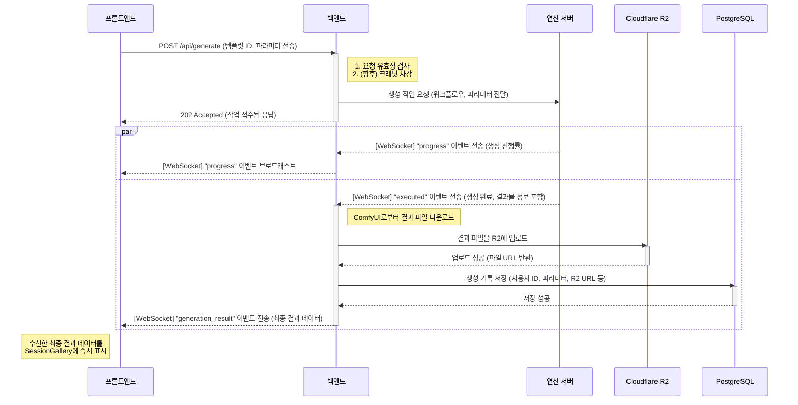

# 시퀀스 다이어그램: 이미지 생성 요청

> 최종 업데이트: 2025년 7월 5일

이 다이어그램은 SurfAI의 가장 핵심적인 기능인 이미지 생성 요청 및 비동기 처리 과정을 보여줍니다. 사용자의 최초 API 요청부터 WebSocket을 통한 실시간 피드백, 그리고 최종 결과물이 처리되어 사용자에게 전달되기까지의 복잡한 상호작용을 상세히 나타냅니다.

