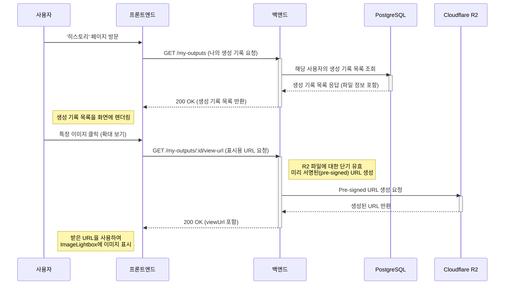

# 시퀀스 다이어그램: 생성 기록 조회

> 최종 업데이트: 2025년 7월 5일

이 다이어그램은 사용자가 '히스토리' 페이지에서 과거에 생성했던 결과물을 조회하고, 특정 결과물을 클릭하여 확대 보기하는 과정을 보여줍니다. 특히 결과물 표시를 위해 백엔드에서 미리 서명된(pre-signed) URL을 동적으로 생성하여 전달하는 흐름을 상세히 나타냅니다.

