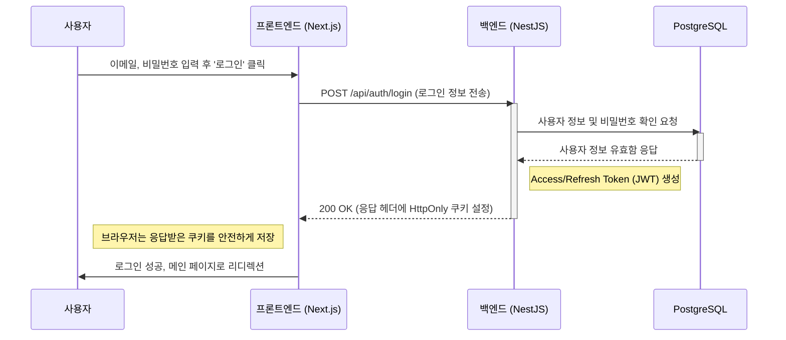

# 시퀀스 다이어그램: 사용자 로그인

> 최종 업데이트: 2025년 7월 5일

이 다이어그램은 사용자가 이메일과 비밀번호를 사용하여 서비스에 로그인하는 전체 과정을 보여줍니다. `HttpOnly` 쿠키와 `JWT`를 이용한 인증 방식의 상호작용을 상세히 나타냅니다.

```mermaid
sequenceDiagram
    participant User as 사용자
    participant Browser as 프론트엔드 (Next.js)
    participant Backend as 백엔드 (NestJS)
    participant DB as PostgreSQL

    User->>Browser: 이메일, 비밀번호 입력 후 '로그인' 클릭
    Browser->>Backend: POST /api/auth/login (로그인 정보 전송)
    
    activate Backend
    Backend->>DB: 사용자 정보 및 비밀번호 확인 요청
    activate DB
    DB-->>Backend: 사용자 정보 유효함 응답
    deactivate DB
    
    note right of Backend: Access/Refresh Token (JWT) 생성
    Backend-->>Browser: 200 OK (응답 헤더에 HttpOnly 쿠키 설정)
    deactivate Backend
    
    note left of Browser: 브라우저는 응답받은 쿠키를 안전하게 저장
    Browser->>User: 로그인 성공, 메인 페이지로 리디렉션
```
