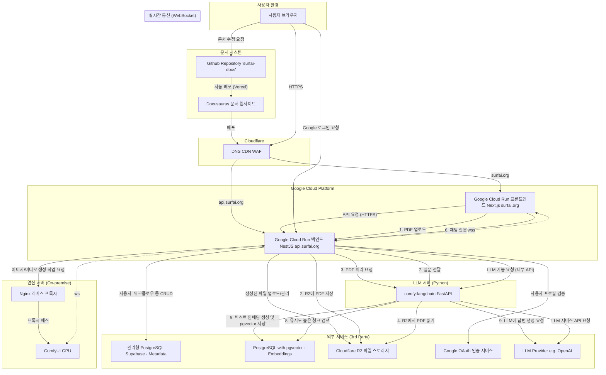

# 아키텍처

🏛️ 프로젝트 아키텍처: SurfAI
최종 업데이트: 2025년 9월 13일

이 문서는 SurfAI 서비스의 전체적인 시스템 아키텍처, 각 구성 요소의 역할, 그리고 주요 데이터 흐름을 상세히 설명합니다.

---

## 1. 아키텍처 목표 및 원칙

-   **분리된 책임 (Decoupled):** 프론트엔드, 백엔드, 연산 서버, 문서 등 각 영역은 독립적인 리포지토리로 관리되어 명확한 책임 분리를 지향합니다.
-   **서버리스 우선 (Serverless First):** 가능하면 서버 관리가 필요 없는 서버리스 플랫폼(`Google Cloud Run`)을 사용하여, 트래픽에 따라 자동으로 확장/축소되고 비용 효율적인 인프라를 구축합니다.
-   **컨테이너 기반 표준화 (Containerized):** 프론트엔드와 백엔드 모두 `Docker` 컨테이너로 패키징하여, 개발-운영 환경의 일관성을 확보하고 배포 유연성을 극대화합니다.
-   **보안:** 모든 통신은 `HTTPS`로 암호화되며, `Cloudflare`를 통해 1차적인 보안(`WAF`, `DDoS` 방어)을, 백엔드에서는 `JWT`, `CSRF`, 역할 기반 접근 제어(`RBAC`) 등 다층적인 보안을 적용합니다.

---

## 2. 전체 시스템 구성도

---

## 3. 구성 요소별 상세 역할

### 가. 프론트엔드 (Frontend) - `comfy-surfai-frontend-next`

-   **플랫폼:** `Google Cloud Run` (Docker 컨테이너)
-   **도메인:** `surfai.org`
-   **기술:** `Next.js` (App Router), `TypeScript`, `Tailwind CSS`, `shadcn/ui`
-   **핵심 역할:**
    -   사용자에게 보여지는 모든 UI(`React` 컴포넌트)를 렌더링합니다.
    -   `AuthContext`를 통해 사용자의 로그인 상태를 전역으로 관리하며, `HttpOnly` 쿠키에 담긴 토큰을 기반으로 동작합니다.
    -   `lib/apiClient.ts`를 통해 모든 백엔드 API 요청을 중앙에서 처리하며, Access Token 만료 시 자동 재발급 로직을 포함합니다.
    -   `hooks/useComfyWebSocket.ts`을 통해 백엔드의 `WebSocket`과 연결하여 생성 진행률, 결과물 등을 실시간으로 수신하고 UI에 반영합니다.

### 나. 백엔드 (Backend) - `comfy-surfai-backend`

-   **플랫폼:** `Google Cloud Run` (Docker 컨테이너)
-   **도메인:** `api.surfai.org`
-   **기술:** `NestJS`, `TypeORM`, `PostgreSQL`, `Passport.js`
-   **핵심 역할:**
    -   모든 비즈니스 로직을 처리하는 **스테이트리스(Stateless)** API 서버이자, 다른 내부 서비스로의 **API 게이트웨이** 역할을 수행합니다.
    -   **인증:** `Google Sign-In` 및 일반 로그인 요청을 처리하고, 검증된 사용자에 대해 `JWT`(Access/Refresh Token)를 생성하여 `HttpOnly` 쿠키로 클라이언트에 설정합니다. `JwtAuthGuard`와 `RolesGuard`를 통해 각 API 엔드포인트의 접근을 제어합니다.
    -   **코인 관리:** 사용자 코인 잔액을 관리하고, 코인 거래 내역을 기록합니다. 관리자용 API를 통해 코인 수동 조정 기능을 제공합니다.
    -   **생성 파이프라인:** 프론트엔드로부터 받은 생성 요청을 `ComfyUI` 연산 서버에 전달하고, `WebSocket`을 통해 진행 상황을 프론트엔드에 브로드캐스트합니다.
    -   **LLM 기능 연동:** 프론트엔드로부터 받은 LLM 관련 요청(일반 채팅, RAG 채팅 등)을 내부 `comfy-langchain` 서버에 전달하고, 그 결과를 받아 다시 프론트엔드에 반환합니다.
    -   **파일 관리:** `ComfyUI`가 생성한 결과 파일 또는 사용자가 업로드한 PDF 파일을 `Cloudflare R2`에 안전하게 업로드하고 관리합니다.

### 다. 연산 서버 (Compute Server)

-   **플랫폼:** 로컬 PC 또는 클라우드 GPU 가상 머신 (`On-demand`/`Spot VM`)
-   **기술:** `ComfyUI`
-   **핵심 역할:**
    -   백엔드로부터 워크플로우와 파라미터를 받아 실제 AI 연산을 수행하는 무거운 작업을 전담합니다.
    -   생성 과정 중 발생하는 `progress`, `executed` 등의 이벤트를 `WebSocket`을 통해 백엔드로 전송합니다.
    -   **Nginx 리버스 프록시**를 사용하여 외부 인터넷에 안전하게 노출되며, 기본 인증(Basic Authentication)을 통해 1차적인 접근 제어를 수행합니다.

### 라. LLM 서버 (LLM Server) - `comfy-langchain`

-   **플랫폼:** `Google Cloud Run` (Docker 컨테이너)
-   **기술:** `FastAPI`, `Python`, `LangChain`
-   **핵심 역할:**
    -   `LangChain` 라이브러리를 사용하여 LLM(거대 언어 모델) 관련 기능을 전문적으로 처리하는 **Python 기반 API 서버**입니다.
    -   **일반 채팅:** NestJS 백엔드로부터 내부 API 요청을 받아, 텍스트 생성, 요약 등의 작업을 수행하고 결과를 반환합니다.
    -   **RAG 파이프라인:** 백엔드로부터 PDF 처리 요청을 받아, 해당 PDF를 읽고 텍스트로 분할한 뒤 벡터로 임베딩하여 `pgvector` 데이터베이스에 저장합니다. 이후 채팅 요청 시, 질문과 관련된 텍스트 조각을 `pgvector`에서 검색하여 LLM에 함께 제공함으로써 근거 기반의 답변을 생성합니다.
    -   내부 API 키(`X-Internal-API-Key`)를 통해 NestJS 백엔드로부터의 요청만 허용하여 보안을 유지합니다.

### 마. 클라우드 인프라 (Cloud Infrastructure)

-   **Google Cloud Run:** 프론트엔드와 백엔드 `Docker` 컨테이너를 실행하고, 트래픽에 따라 자동으로 확장/축소되는 서버리스 환경을 제공합니다.
-   **PostgreSQL (by Supabase):** 사용자, 워크플로우, 생성 기록, 코인 거래 내역 등 정형 데이터를 영구적으로 저장합니다. **`pgvector`** 확장 프로그램을 활성화하여, RAG 기능을 위한 텍스트 임베딩 벡터를 저장하고 유사도 검색을 수행합니다.
-   **Cloudflare R2:** 생성된 이미지/비디오 파일, RAG를 위해 사용자가 업로드한 PDF 파일 등을 저장하는 객체 스토리지입니다.
-   **Cloudflare (전체):** `surfai.org` 도메인의 `DNS`를 관리하고, `WAF`, `CDN` 등의 보안 및 성능 최적화 기능을 제공합니다.

### 바. 문서 시스템 (Documentation System) - `surfai-docs`

-   **플랫폼:** `Vercel`
-   **도메인:** `docs.surfai.org`
-   **기술:** `Docusaurus`, `React`, `Markdown(MDX)`
-   **핵심 역할:**
    -   프로젝트의 모든 기술 문서, 아키텍처, 의사결정 로그 등을 정적 웹사이트 형태로 제공하는 **단일 진실 공급원(Single Source of Truth)** 역할을 합니다.
    -   모든 문서는 `Markdown` 파일로 작성되어 `GitHub`에서 코드와 함께 버전 관리됩니다.
    -   `Vercel`과의 `Git` 연동을 통해, `main` 브랜치에 변경사항이 푸시될 때마다 자동으로 사이트를 빌드하고 배포하는 CI/CD 파이프라인이 구축되어 있습니다.
    -   다국어(i18n) 기능을 통해 한국어, 영어 등 여러 언어로 문서를 제공합니다.

---

## 4. 주요 데이터 흐름

### 가. 사용자 인증 흐름 (`HttpOnly` Cookie + `JWT`)

1.  **로그인 시도:** 프론트엔드에서 `/api/auth/google` 또는 `/api/auth/login` API를 호출합니다.
2.  **인증 및 토큰 발급:** 백엔드는 신원을 확인한 후, Access Token(15분)과 Refresh Token(x일)을 생성합니다.
3.  **쿠키 설정:** 백엔드는 응답 헤더의 `Set-Cookie`를 통해, 발급된 토큰들을 `HttpOnly`, `Secure`, `SameSite=None` (운영 환경) 속성을 가진 쿠키로 브라우저에 저장시킵니다.
4.  **API 요청:** 이후 프론트엔드의 `apiClient`는 `credentials: 'include'` 옵션을 통해, 모든 API 요청 시 브라우저가 자동으로 쿠키를 포함하여 보내도록 합니다.
5.  **토큰 검증:** 백엔드의 `JwtAuthGuard`는 요청 쿠키에 담긴 `access_token`을 검증하여 사용자를 인증합니다.
6.  **토큰 재발급:** Access Token이 만료되어 `401` 에러가 발생하면, `apiClient`가 자동으로 `/api/auth/refresh` API를 호출합니다. 백엔드의 `JwtRefreshGuard`가 `refresh_token` 쿠키를 검증하고, 성공 시 새로운 토큰들을 쿠키로 재설정해줍니다.

### 나. 코인 차감 및 생성 파이프라인 흐름

1.  **코인 차감 요청:** 사용자가 프론트엔드에서 이미지 생성을 요청하면, 먼저 `POST /api/coin/deduct` API를 호출하여 코인을 차감합니다.
2.  **코인 차감 처리:** 백엔드는 사용자 코인 잔액을 확인하고, 충분하면 코인을 차감하고 거래 내역을 기록합니다. 코인 잔액이 부족하면 에러를 반환합니다.
3.  **생성 작업 전달 (코인 차감 성공 시):** 코인 차감이 성공하면, 프론트엔드는 `POST /api/generate` API를 호출하여 이미지 생성 작업을 백엔드에 전달합니다.
4.  **작업 처리:** 백엔드는 요청을 받아 유효성을 검사하고, `ComfyUI` 연산 서버에 작업을 전달합니다.
5.  **실시간 피드백:** 연산 서버는 생성 과정에서 발생하는 `progress` 등의 `WebSocket` 이벤트를 백엔드로 보냅니다. 백엔드의 `EventsGateway`는 이 메시지를 받아 다시 프론트엔드로 브로드캐스트합니다.
6.  **결과물 처리:** 생성이 완료(`executed` 메시지)되면, 백엔드는 결과 파일을 `R2`에 업로드하고 `DB`에 기록합니다.
7.  **최종 알림:** 백엔드는 최종 결과 정보(DB ID, 표시용 미리 서명된 URL 등)를 `generation_result` `WebSocket` 이벤트로 프론트엔드에 전송하여, `SessionGallery`에 결과물이 표시되도록 합니다.