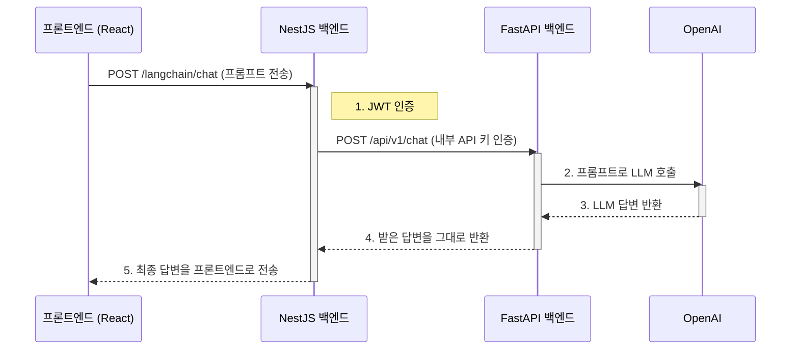

# AI Chat

> 최종 업데이트: 2025년 9월 9일

이 문서는 SurfAI의 AI 채팅 기능에 대한 기술적 사양과 아키텍처, 주요 구성 요소를 설명합니다.

---

## 1. 기능 개요

AI 채팅은 사용자가 SurfAI 플랫폼 내에서 직접 거대 언어 모델(LLM)과 대화할 수 있는 기능입니다. 사용자는 간단한 질문부터 복잡한 요청까지 자유롭게 입력할 수 있으며, AI는 이전 대화 내용을 기억하지 않는 단발성(Stateless) 답변을 제공합니다.

이 기능은 `/surf` 페이지의 기능 카드 형태로 제공되며, 클릭 시 모달(Modal) 창을 통해 활성화됩니다.

---

## 2. 아키텍처 및 데이터 흐름

AI 채팅 기능은 기존 백엔드(`comfy-surfai-backend`)가 API 게이트웨이 역할을 수행하여, 실제 LLM 로직을 처리하는 별도의 Python 서버(`comfy-langchain`)를 호출하는 구조로 설계되었습니다. 이를 통해 인증은 중앙에서 관리하고, 기능은 마이크로서비스 형태로 분리하여 유지보수성을 높였습니다.

---

## 3. 주요 구성 요소

### 가. 프론트엔드 (`ChatModal.tsx`)

-   **위치:** `src/components/common/ChatModal.tsx`
-   **역할:** AI 채팅 기능의 전체 UI와 사용자 상호작용을 담당하는 재사용 가능한 모달 컴포넌트입니다.
-   **주요 기능:**
    -   사용자 입력을 받는 `Input`과 전송 `Button`을 포함합니다.
    -   `apiClient`를 통해 백엔드의 `/langchain/chat` 엔드포인트를 호출합니다.
    -   API 요청 상태(로딩, 에러 등)를 관리하고 사용자에게 피드백을 제공합니다.
    -   AI로부터 받은 답변을 스크롤 가능한 영역에 표시합니다.

### 나. NestJS 백엔드 (`LangchainModule`)

-   **위치:** `src/langchain/`
-   **역할:** 프론트엔드와 FastAPI 서버 사이의 중개자 및 게이트웨이 역할을 합니다.
-   **주요 기능:**
    -   `LangchainController`: `POST /langchain/chat` 엔드포인트를 정의하고, `JwtAuthGuard`를 통해 로그인한 사용자만 요청할 수 있도록 보호합니다.
    -   `LangchainService`: `HttpService`를 사용하여 FastAPI 서버에 내부 API를 호출합니다. 요청 시 헤더에 `X-Internal-API-Key`를 포함하여 서버 간 인증을 수행합니다.

### 다. FastAPI 백엔드 (`comfy-langchain`)

-   **위치:** `comfy-langchain/app/`
-   **역할:** `LangChain` 라이브러리를 사용하여 실제 LLM 호출을 담당하는 Python 서버입니다.
-   **주요 기능:**
    -   `security.py`: NestJS 백엔드로부터 받은 `X-Internal-API-Key`를 검증하여 인가된 요청만 처리합니다.
    -   `services.py`: `langchain_openai`를 통해 `ChatOpenAI` 모델을 초기화하고, 주어진 프롬프트에 대한 답변을 생성합니다.
    -   `api.py`: `/api/v1/chat` 엔드포인트를 정의하고, 보안 및 서비스 로직을 연결합니다.