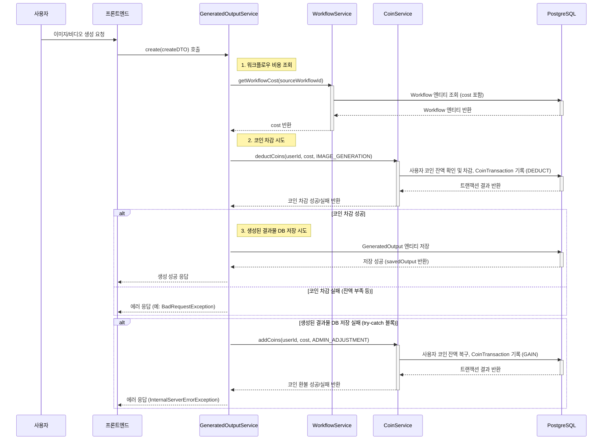

# 코인 소모 워크플로우

💰 코인 소모 워크플로우: 워크플로우 사용
최종 업데이트: 2025년 7월 22일

이 문서는 사용자가 워크플로우를 사용하여 이미지 또는 비디오를 생성할 때 코인이 어떻게 소모되는지에 대한 상세한 흐름을 설명합니다.

---

## 1. 개요

사용자가 SurfAI에서 워크플로우를 통해 콘텐츠를 생성할 때, 해당 워크플로우에 설정된 비용만큼 코인이 차감됩니다. 이 과정은 코인 잔액 확인, 차감, 그리고 생성 과정 중 발생할 수 있는 오류에 대한 코인 환불 로직을 포함합니다.

---

## 2. 코인 소모 시퀀스 다이어그램

---

## 3. 주요 구성 요소별 역할

*   **프론트엔드 (Frontend):** 사용자로부터 생성 요청을 받아 백엔드로 전달합니다.
*   **`GeneratedOutputService`:** 생성 요청을 처리하는 핵심 서비스입니다. `WorkflowService`를 통해 워크플로우 비용을 조회하고, `CoinService`를 통해 코인을 차감합니다. 생성 기록 저장 실패 시 코인 환불 로직을 담당합니다.
*   **`WorkflowService`:** 특정 워크플로우 템플릿의 비용(`cost`)을 조회하는 역할을 합니다.
*   **`CoinService`:** 사용자의 코인 잔액을 관리하고, 코인 차감(`deductCoins`) 및 추가(`addCoins`) 트랜잭션을 처리합니다.
*   **`PostgreSQL` (DB):** 사용자 코인 잔액, 코인 거래 내역(`CoinTransaction`), 워크플로우 템플릿(`Workflow`), 생성된 결과물(`GeneratedOutput`) 정보를 저장합니다.

---

## 4. 예외 처리 및 환불 로직

*   **코인 잔액 부족:** `deductCoins` 호출 시 사용자의 코인 잔액이 부족하면 `BadRequestException`이 발생하며, 생성 요청은 실패합니다.
*   **생성 기록 저장 실패:** 코인 차감은 성공했으나, `GeneratedOutput` 엔티티를 데이터베이스에 저장하는 과정에서 오류가 발생할 경우, `GeneratedOutputService`의 `catch` 블록에서 `CoinService.addCoins`를 호출하여 차감했던 코인을 사용자에게 환불합니다. 이때 `CoinTransactionReason.ADMIN_ADJUSTMENT` 사유로 기록됩니다.
