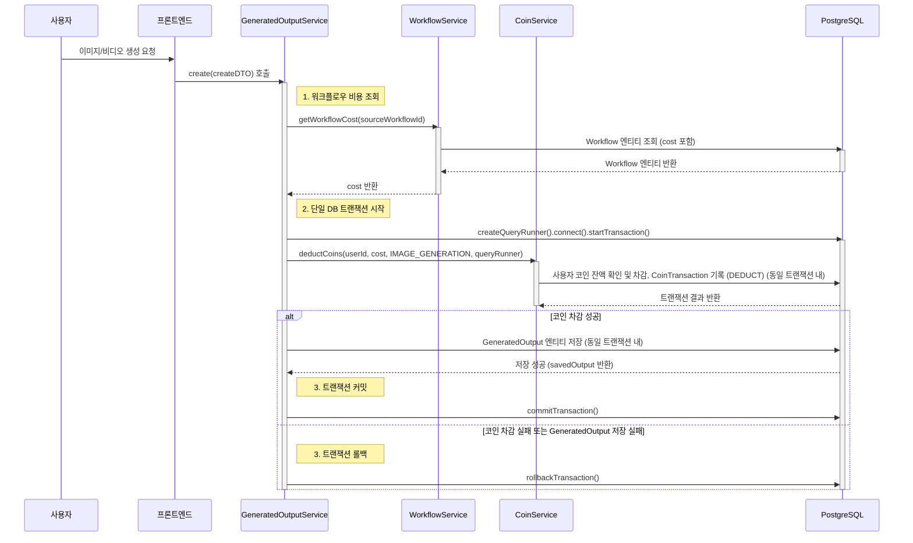

# 코인 소모 워크플로우 (개선된 원자성)

💰 코인 소모 워크플로우: 워크플로우 사용 (개선된 원자성)
최종 업데이트: 2025년 7월 22일

이 문서는 사용자가 워크플로우를 사용하여 이미지 또는 비디오를 생성할 때 코인이 소모되는 과정에서, 코인 차감과 생성 기록 저장을 하나의 데이터베이스 트랜잭션으로 묶어 데이터 일관성을 보장하는 개선된 흐름을 설명합니다.

---

## 1. 개요

기존 워크플로우에서 코인 차감과 생성 기록 저장이 별개의 트랜잭션으로 처리될 경우 발생할 수 있는 데이터 불일치 문제를 해결하기 위해, 이 두 작업을 단일 데이터베이스 트랜잭션으로 묶습니다. 이를 통해 코인 차감과 생성 기록 저장이 모두 성공하거나, 둘 다 실패하여 롤백되는 원자성을 보장합니다.

---

## 2. 코인 소모 시퀀스 다이어그램 (개선된 원자성)

---

## 3. 주요 개선 사항

*   **원자성 보장:** `GeneratedOutputService` 내에서 `QueryRunner`를 사용하여 코인 차감(`deductCoins`)과 생성된 결과물 저장(`outputRepository.save`)을 하나의 데이터베이스 트랜잭션으로 묶었습니다. 이로써 두 작업 중 하나라도 실패하면 전체 트랜잭션이 롤백되어 데이터 불일치를 방지합니다.
*   **데이터 일관성:** 코인이 차감되었으나 결과물이 저장되지 않거나, 그 반대의 상황이 발생할 가능성을 제거하여 시스템의 데이터 일관성을 크게 향상시킵니다.
*   **환불 로직 제거 (성공 경로):** 트랜잭션이 원자적으로 처리되므로, 코인 차감 후 생성 기록 저장 실패 시 별도의 환불 로직(`addCoins`)이 필요 없어집니다. 트랜잭션 롤백만으로 충분합니다. (단, `deductCoins` 자체에서 발생하는 예외는 여전히 처리해야 할 수 있습니다.)

---

## 4. 구현 시 고려사항

*   **`CoinService.deductCoins` 수정:** `deductCoins` 메서드가 외부에서 전달받은 `QueryRunner`를 사용하여 트랜잭션에 참여할 수 있도록 수정해야 합니다.
*   **`GeneratedOutputService.create` 수정:** `QueryRunner`를 생성하고, `deductCoins` 및 `outputRepository.save` 호출 시 해당 `QueryRunner`를 사용하도록 로직을 변경해야 합니다. `try-catch` 블록에서 `commitTransaction` 또는 `rollbackTransaction`을 호출하도록 합니다.