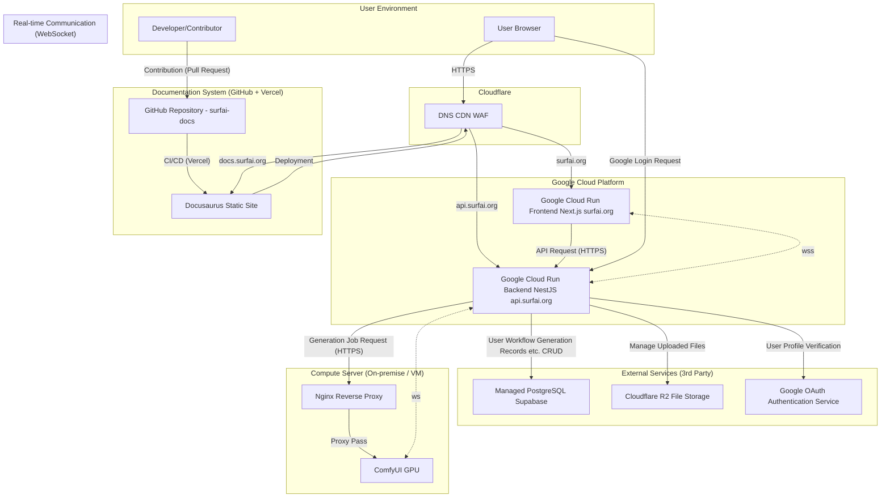

# Architecture

🏛️ Project Architecture: SurfAI
Last Updated: June 29, 2025

This document details the overall system architecture of the SurfAI service, the role of each component, and the main data flows.

---

## 1. Architecture Goals and Principles

-   **Decoupled Responsibilities:** Frontend, backend, compute server, documentation, etc., each area is managed in independent repositories, aiming for clear separation of responsibilities.
-   **Serverless First:** Where possible, serverless platforms (`Google Cloud Run`) are used to build cost-effective infrastructure that automatically scales up/down with traffic, requiring no server management.
-   **Containerized Standardization:** Both frontend and backend are packaged into `Docker` containers to ensure consistency between development and production environments and maximize deployment flexibility.
-   **Security:** All communication is encrypted with `HTTPS`, `Cloudflare` provides primary security (`WAF`, `DDoS` protection), and the backend applies multi-layered security including `JWT`, `CSRF`, and Role-Based Access Control (`RBAC`).

---

## 2. Overall System Diagram

---

## 3. Detailed Role of Each Component

### A. Frontend - `comfy-surfai-frontend-next`

-   **Platform:** `Google Cloud Run` (Docker Container)
-   **Domain:** `surfai.org`
-   **Technologies:** `Next.js` (App Router), `TypeScript`, `Tailwind CSS`, `shadcn/ui`
-   **Key Roles:**
    -   Renders all UI (`React` components) visible to the user.
    -   Manages user login state globally via `AuthContext`, operating based on tokens in `HttpOnly` cookies.
    -   Handles all backend API requests centrally via `lib/apiClient.ts`, including automatic re-issuance logic for expired Access Tokens.
    -   Connects to the backend's `WebSocket` via `hooks/useComfyWebSocket.ts` to receive real-time generation progress and results, reflecting them in the UI.

### B. Backend - `comfy-surfai-backend`

-   **Platform:** `Google Cloud Run` (Docker Container)
-   **Domain:** `api.surfai.org`
-   **Technologies:** `NestJS`, `TypeORM`, `PostgreSQL`, `Passport.js`
-   **Key Roles:**
    -   A **stateless** API server that handles all business logic.
    -   **Authentication:** Processes `Google Sign-In` and general login requests, generates `JWT` (Access/Refresh Token) for verified users, and sets them as `HttpOnly` cookies in the client. Access to each API endpoint is controlled via `JwtAuthGuard` and `RolesGuard`.
    -   **Generation Pipeline:** Forwards generation requests from the frontend to the `ComfyUI` compute server and broadcasts progress to the frontend via `WebSocket`.
    -   **Result Processing:** Once `ComfyUI` completes generation, it downloads the result files (images/videos), uploads them to `Cloudflare R2`, and permanently records related metadata (`usedParameters`, etc.) in the `PostgreSQL` database.

### C. Compute Server

-   **Platform:** Local PC or Cloud GPU Virtual Machine (`On-demand`/`Spot VM`)
-   **Technologies:** `ComfyUI`
-   **Key Roles:**
    -   Handles heavy tasks by receiving workflows and parameters from the backend and performing actual AI computations.
    -   Sends `WebSocket` events such as `progress` and `executed` generated during the creation process to the backend.
    -   Exposed securely to the external internet using an **Nginx Reverse Proxy**, performing primary access control through basic authentication.

### D. Cloud Infrastructure

-   **Google Cloud Run:** Runs frontend and backend `Docker` containers, providing a serverless environment that automatically scales with traffic.
-   **PostgreSQL (by Supabase):** A database that permanently stores all data, including users, workflows, and generation records.
-   **Cloudflare R2:** An object storage for generated image/video files (operated separately as private and public buckets).
-   **Cloudflare (Overall):** Manages `DNS` for the `surfai.org` domain and provides security and performance optimization features such as `WAF` and `CDN`.

### E. Documentation System - `surfai-docs`

-   **Platform:** `Vercel`
-   **Domain:** `docs.surfai.org`
-   **Technologies:** `Docusaurus`, `React`, `Markdown(MDX)`
-   **Key Roles:**
    -   Serves as the **Single Source of Truth** for all project technical documents, architecture, decision logs, etc., provided as a static website.
    -   All documents are written in `Markdown` files and version-controlled with `Git` alongside the code on `GitHub`.
    -   A CI/CD pipeline is established through `Git` integration with `Vercel`, automatically building and deploying the site whenever changes are pushed to the `main` branch.
    -   Provides documents in multiple languages (Korean, English, etc.) through its i18n feature.

---

## 4. Key Data Flows

### A. User Authentication Flow (`HttpOnly` Cookie + `JWT`)

1.  **Login Attempt:** The frontend calls the `/api/auth/google` or `/api/auth/login` API.
2.  **Authentication and Token Issuance:** The backend verifies identity and generates Access Token (15 min) and Refresh Token (2 days).
3.  **Cookie Setting:** The backend sets the issued tokens as `HttpOnly`, `Secure`, `SameSite=None` (production environment) cookies in the browser via the `Set-Cookie` response header.
4.  **API Request:** Subsequently, the frontend's `apiClient` automatically includes cookies with all API requests via the `credentials: 'include'` option.
5.  **Token Validation:** The backend's `JwtAuthGuard` validates the `access_token` in the request cookie to authenticate the user.
6.  **Token Re-issuance:** If the Access Token expires and a `401` error occurs, `apiClient` automatically calls the `/api/auth/refresh` API. The backend's `JwtRefreshGuard` validates the `refresh_token` cookie and, if successful, re-sets new tokens as cookies.

### B. Generation Pipeline Flow

1.  **Request:** When a user enters parameters in the frontend and clicks "Generate," the `POST /api/generate` API is called.
2.  **Job Delivery:** The backend receives the request, validates it, and delivers the job to the `ComfyUI` compute server.
3.  **Real-time Feedback:** The compute server sends `WebSocket` events such as `progress` during the generation process to the backend. The backend's `EventsGateway` receives these messages and broadcasts them back to the frontend.
4.  **Result Processing:** Once generation is complete (`executed` message), the backend uploads the result files to `R2` and records them in the `DB`.
5.  **Final Notification:** The backend sends final result information (DB ID, pre-signed URL for display, etc.) to the frontend via a `generation_result` `WebSocket` event, so that the results are displayed in the `SessionGallery`.