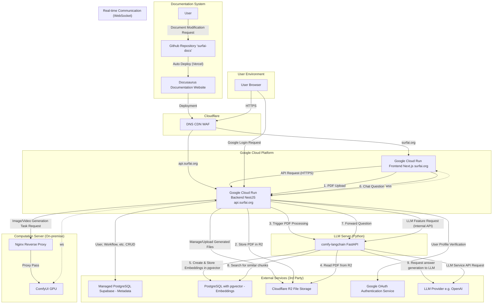

# Architecture

🏛️ Project Architecture: SurfAI
Last Updated: September 13, 2025

This document details the overall system architecture of the SurfAI service, the role of each component, and the main data flows.

---

## 1. Architecture Goals and Principles

-   **Decoupled Responsibilities:** Frontend, backend, computation server, documentation, etc., are managed in independent repositories, aiming for clear separation of responsibilities.
-   **Serverless First:** Where possible, we use serverless platforms (`Google Cloud Run`) that do not require server management, building a cost-effective infrastructure that automatically scales up/down with traffic.
-   **Containerized Standardization:** Both frontend and backend are packaged as `Docker` containers, ensuring consistency between development and production environments and maximizing deployment flexibility.
-   **Security:** All communication is encrypted with `HTTPS`, `Cloudflare` provides primary security (`WAF`, `DDoS` protection), and the backend applies multi-layered security including `JWT`, `CSRF`, and Role-Based Access Control (`RBAC`).

---

## 2. Overall System Diagram

---

## 3. Detailed Role of Each Component

### A. Frontend - `comfy-surfai-frontend-next`

-   **Platform:** `Google Cloud Run` (Docker Container)
-   **Domain:** `surfai.org`
-   **Technology:** `Next.js` (App Router), `TypeScript`, `Tailwind CSS`, `shadcn/ui`
-   **Core Role:**
    -   Renders all UI (`React` components) displayed to the user.
    -   Globally manages user login status via `AuthContext`, operating based on tokens stored in `HttpOnly` cookies.
    -   Handles all backend API requests centrally via `lib/apiClient.ts`, including automatic reissuance logic when Access Tokens expire.
    -   Connects to the backend's `WebSocket` via `hooks/useComfyWebSocket.ts` to receive generation progress, results, etc., in real-time and reflect them in the UI.

### B. Backend - `comfy-surfai-backend`

-   **Platform:** `Google Cloud Run` (Docker Container)
-   **Domain:** `api.surfai.org`
-   **Technology:** `NestJS`, `TypeORM`, `PostgreSQL`, `Passport.js`
-   **Core Role:**
    -   Acts as a **stateless** API server that handles all business logic and serves as an **API Gateway** to other internal services.
    -   **Authentication:** Processes `Google Sign-In` and general login requests, generates `JWT` (Access/Refresh Token) for authenticated users, and sets them as `HttpOnly` cookies on the client. Controls access to each API endpoint via `JwtAuthGuard` and `RolesGuard`.
    -   **Coin Management:** Manages user coin balances and records coin transactions. Provides manual coin adjustment functionality via admin APIs.
    -   **Generation Pipeline:** Forwards generation requests from the frontend to the `ComfyUI` computation server and broadcasts progress to the frontend via `WebSocket`.
    -   **LLM Feature Integration:** Forwards LLM-related requests (general chat, RAG chat, etc.) from the frontend to the internal `comfy-langchain` server and returns the results.
    -   **File Management:** Securely uploads and manages result files generated by `ComfyUI` or PDF files uploaded by the user to `Cloudflare R2`.

### C. Computation Server

-   **Platform:** Local PC or Cloud GPU Virtual Machine (`On-demand`/`Spot VM`)
-   **Technology:** `ComfyUI`
-   **Core Role:**
    -   Dedicated to performing heavy AI computations, receiving workflows and parameters from the backend.
    -   Sends `progress`, `executed`, and other events occurring during generation to the backend via `WebSocket`.
    -   Securely exposed to the external internet using an **Nginx Reverse Proxy**, performing primary access control via Basic Authentication.

### D. LLM Server - `comfy-langchain`

-   **Platform:** `Google Cloud Run` (Docker Container)
-   **Technology:** `FastAPI`, `Python`, `LangChain`
-   **Core Role:**
    -   A **Python-based API server** that specializes in handling LLM (Large Language Model) related features using the `LangChain` library.
    -   **General Chat:** Receives internal API requests from the NestJS backend, performs tasks such as text generation or summarization, and returns the results.
    -   **RAG Pipeline:** On request from the backend, it reads a PDF, splits it into text chunks, creates vector embeddings, and stores them in the `pgvector` database. For subsequent chat requests, it retrieves relevant text chunks from `pgvector` and provides them to the LLM to generate a context-aware answer.
    -   Maintains security by only allowing requests from the NestJS backend via an internal API key (`X-Internal-API-Key`).

### E. Cloud Infrastructure

-   **Google Cloud Run:** Runs frontend and backend `Docker` containers, providing a serverless environment that automatically scales up/down with traffic.
-   **PostgreSQL (by Supabase):** Permanently stores structured data like users, workflows, generation history, and coin transactions. The **`pgvector`** extension is enabled to store and perform similarity searches on text embeddings for the RAG feature.
-   **Cloudflare R2:** Object storage for generated image/video files and user-uploaded PDF files for RAG.
-   **Cloudflare (Overall):** Manages `DNS` for the `surfai.org` domain and provides security and performance optimization features such as `WAF` and `CDN`.

### F. Documentation System - `surfai-docs`

-   **Platform:** `Vercel`
-   **Domain:** `docs.surfai.org`
-   **Technology:** `Docusaurus`, `React`, `Markdown(MDX)`
-   **Core Role:**
    -   Serves as the **Single Source of Truth** providing all technical documentation, architecture, decision logs, etc., in a static website format.
    -   All documents are written as `Markdown` files and version-controlled with `GitHub`.
    -   A CI/CD pipeline is established through `Git` integration with `Vercel`, automatically building and deploying the site whenever changes are pushed to the `main` branch.
    -   Provides multilingual documentation (Korean, English, etc.) through i18n features.

---

## 4. Key Data Flow

### A. User Authentication Flow (`HttpOnly` Cookie + `JWT`)

1.  **Login Attempt:** The frontend calls the `/api/auth/google` or `/api/auth/login` API.
2.  **Authentication and Token Issuance:** After verifying identity, the backend generates an Access Token (15 min) and a Refresh Token (2 days).
3.  **Cookie Setting:** The backend sets the issued tokens as `HttpOnly`, `Secure`, `SameSite=None` (production environment) cookies in the browser via the `Set-Cookie` header in the response.
4.  **API Request:** Subsequently, the frontend's `apiClient` automatically includes cookies with all API requests via the `credentials: 'include'` option.
5.  **Token Validation:** The backend's `JwtAuthGuard` authenticates the user by validating the `access_token` in the request cookie.
6.  **Token Reissue:** If the Access Token expires and a `401` error occurs, `apiClient` automatically calls the `/api/auth/refresh` API. The backend's `JwtRefreshGuard` validates the `refresh_token` cookie, and if successful, resets new tokens as cookies.

### B. Coin Deduction and Generation Pipeline Flow

1.  **Coin Deduction Request:** When a user requests image generation from the frontend, the `POST /api/coin/deduct` API is called first to deduct coins.
2.  **Coin Deduction Processing:** The backend checks the user's coin balance, and if sufficient, deducts coins and records the transaction. If the coin balance is insufficient, it returns an error.
3.  **Generation Task Transfer (on successful coin deduction):** If coin deduction is successful, the frontend calls the `POST /api/generate` API to transfer the image generation task to the backend.
4.  **Task Processing:** The backend receives the request, validates it, and forwards the task to the `ComfyUI` computation server.
5.  **Real-time Feedback:** The computation server sends `WebSocket` events (e.g., `progress`) occurring during generation to the backend. The backend's `EventsGateway` receives these messages and broadcasts them back to the frontend.
6.  **Result Processing:** Once generation is complete (`executed` message), the backend uploads the result file to `R2` and records it in the `DB`.
7.  **Final Notification:** The backend sends final result information (DB ID, pre-signed URL for display, etc.) to the frontend as a `generation_result` `WebSocket` event, causing the result to be displayed in the `SessionGallery`.