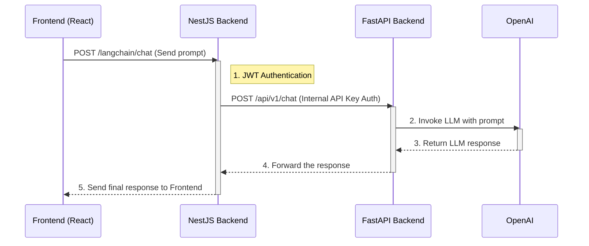

# AI Chat

> Last Updated: September 9, 2025

This document describes the technical specifications, architecture, and key components of SurfAI's AI Chat feature.

---

## 1. Feature Overview

The AI Chat feature allows users to converse directly with a Large Language Model (LLM) within the SurfAI platform. Users can input anything from simple questions to complex requests, and the AI provides a stateless response without remembering previous parts of the conversation.

This feature is provided as a feature card on the `/surf` page and is activated via a modal window upon clicking.

---

## 2. Architecture and Data Flow

The AI Chat feature is designed with an architecture where the existing backend (`comfy-surfai-backend`) acts as an API gateway, calling a separate Python server (`comfy-langchain`) that handles the actual LLM logic. This approach allows for centralized authentication while separating features into microservices for better maintainability.

---

## 3. Key Components

### A. Frontend (`ChatModal.tsx`)

-   **Location:** `src/components/common/ChatModal.tsx`
-   **Role:** A reusable modal component that handles the entire UI and user interaction for the AI chat feature.
-   **Key Features:**
    -   Includes an `Input` for user prompts and a 'Send' `Button`.
    -   Calls the backend's `/langchain/chat` endpoint via `apiClient`.
    -   Manages API request states (loading, error, etc.) and provides feedback to the user.
    -   Displays the AI's response in a scrollable area.

### B. NestJS Backend (`LangchainModule`)

-   **Location:** `src/langchain/`
-   **Role:** Acts as a mediator and gateway between the frontend and the FastAPI server.
-   **Key Features:**
    -   `LangchainController`: Defines the `POST /langchain/chat` endpoint and protects it with `JwtAuthGuard` to allow only logged-in users.
    -   `LangchainService`: Uses `HttpService` to make internal API calls to the FastAPI server. It includes the `X-Internal-API-Key` in the header for server-to-server authentication.

### C. FastAPI Backend (`comfy-langchain`)

-   **Location:** `comfy-langchain/app/`
-   **Role:** A Python server that uses the `LangChain` library to handle the actual LLM calls.
-   **Key Features:**
    -   `security.py`: Verifies the `X-Internal-API-Key` from the NestJS backend to process only authorized requests.
    -   `services.py`: Initializes the `ChatOpenAI` model via `langchain_openai` and generates a response for a given prompt.
    -   `api.py`: Defines the `/api/v1/chat` endpoint and connects the security and service logic.