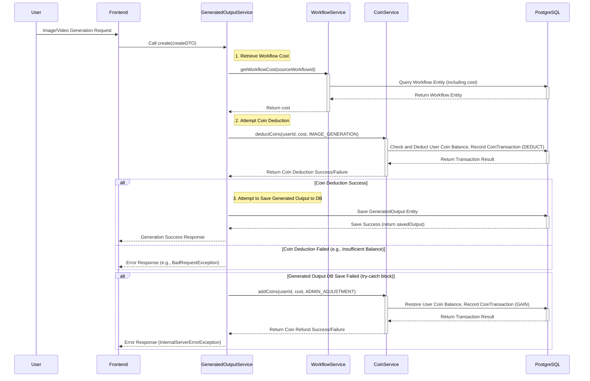

# Coin Consumption Workflow

💰 Coin Consumption Workflow: Using Workflows
Last Updated: July 22, 2025

This document describes the detailed flow of how coins are consumed when a user generates an image or video using a workflow.

---

## 1. Overview

When a user generates content through a workflow in SurfAI, coins are deducted according to the cost set for that workflow. This process includes checking the coin balance, deducting coins, and a coin refund logic for errors that may occur during the generation process.

---

## 2. Coin Consumption Sequence Diagram

---

## 3. Role by Key Component

*   **Frontend:** Receives generation requests from the user and sends them to the backend.
*   **`GeneratedOutputService`:** The core service that processes generation requests. It retrieves workflow costs via `WorkflowService` and deducts coins via `CoinService`. It handles coin refund logic if saving the generation record fails.
*   **`WorkflowService`:** Responsible for retrieving the cost (`cost`) of a specific workflow template.
*   **`CoinService`:** Manages user coin balances and processes coin deduction (`deductCoins`) and addition (`addCoins`) transactions.
*   **`PostgreSQL` (DB):** Stores user coin balances, coin transaction history (`CoinTransaction`), workflow templates (`Workflow`), and generated output information (`GeneratedOutput`).

---

## 4. Exception Handling and Refund Logic

*   **Insufficient Coin Balance:** If the user's coin balance is insufficient when `deductCoins` is called, a `BadRequestException` is thrown, and the generation request fails.
*   **Generated Output Save Failure:** If coin deduction succeeds but an error occurs during the process of saving the `GeneratedOutput` entity to the database, the `catch` block in `GeneratedOutputService` calls `CoinService.addCoins` to refund the deducted coins to the user. In this case, it is recorded with the `CoinTransactionReason.ADMIN_ADJUSTMENT` reason.
