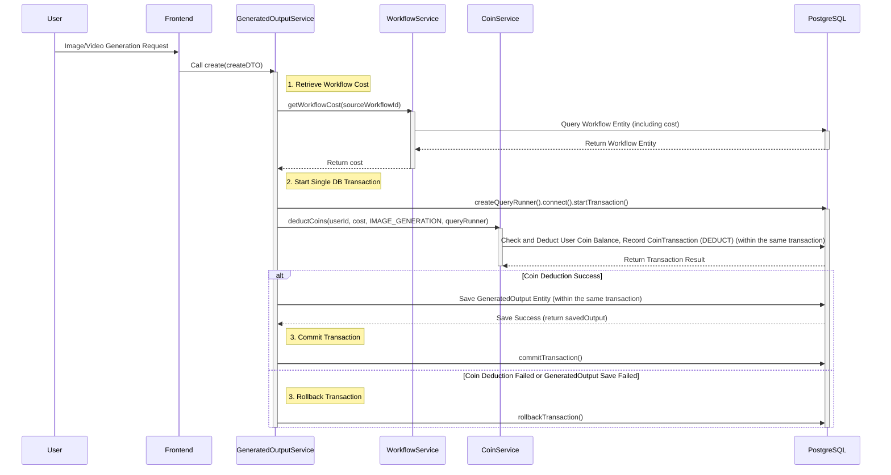

# Coin Consumption Workflow (Improved Atomicity)

💰 Coin Consumption Workflow: Using Workflows (Improved Atomicity)
Last Updated: July 22, 2025

This document describes an improved flow that ensures data consistency by bundling coin deduction and generation record saving into a single database transaction when a user generates an image or video using a workflow.

---

## 1. Overview

To resolve data inconsistency issues that can arise when coin deduction and generation record saving are handled as separate transactions in the existing workflow, these two operations are now bundled into a single database transaction. This ensures atomicity, meaning both coin deduction and generation record saving either succeed together or both fail and are rolled back.

---

## 2. Coin Consumption Sequence Diagram (Improved Atomicity)

---

## 3. Key Improvements

*   **Ensured Atomicity:** Coin deduction (`deductCoins`) and saving generated results (`outputRepository.save`) are bundled into a single database transaction within `GeneratedOutputService` using `QueryRunner`. This prevents data inconsistency by rolling back the entire transaction if either operation fails.
*   **Data Consistency:** Eliminates the possibility of coins being deducted but results not being saved, or vice versa, significantly improving the system's data consistency.
*   **Refund Logic Removal (Success Path):** Since transactions are handled atomically, a separate refund logic (`addCoins`) is no longer needed if saving the generation record fails after coin deduction. Transaction rollback is sufficient. (However, exceptions occurring within `deductCoins` itself may still need to be handled.)

---

## 4. Implementation Considerations

*   **`CoinService.deductCoins` Modification:** The `deductCoins` method must be modified to accept an externally passed `QueryRunner` to participate in the transaction.
*   **`GeneratedOutputService.create` Modification:** The logic must be changed to create a `QueryRunner` and use it when calling `deductCoins` and `outputRepository.save`. Ensure `commitTransaction` or `rollbackTransaction` is called within a `try-catch` block.
