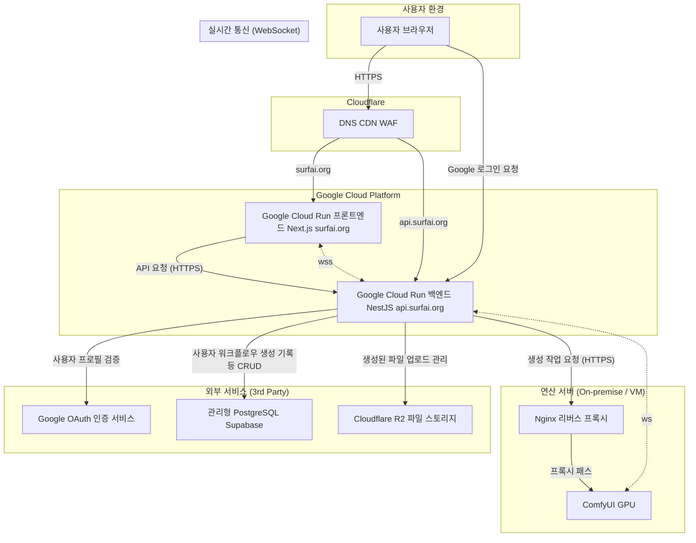

🏛️ SurfAI 프로젝트의 전체적인 구조
최종 업데이트: 2025년 6월 29일

이 문서는 SurfAI 서비스가 어떻게 구성되어 있고, 각 부분이 어떤 역할을 하며, 정보가 어떻게 주고받아지는지 쉽게 설명해 드립니다.

---

## 1. 프로젝트를 만드는 목표와 규칙

-   **역할을 명확히 나누기:** 웹사이트 화면, 뒤에서 일하는 서버, 그림/영상을 만드는 컴퓨터, 그리고 지금 보고 계신 문서까지, 각자 맡은 일을 분명히 나누어 독립적으로 관리합니다.
-   **서버 관리 없이 편리하게:** 가능하면 서버를 직접 관리할 필요 없는 `Google Cloud Run` 같은 서비스를 사용해서, 사용자가 많아져도 자동으로 잘 작동하고 비용도 효율적으로 사용합니다.
-   **규칙적인 포장 방식:** 웹사이트와 서버 프로그램을 `Docker`라는 표준화된 상자에 담아서, 개발할 때나 실제로 서비스할 때나 똑같이 작동하도록 만들고, 나중에 다른 곳으로 옮기기도 쉽게 합니다.
-   **안전하게 보호하기:** 모든 정보는 `HTTPS`로 암호화해서 주고받으며, `Cloudflare`라는 서비스로 외부의 나쁜 공격을 막습니다. 또한, 서버에서는 `JWT`, `CSRF`, `RBAC` 같은 기술을 사용해서 로그인 정보를 안전하게 지키고, 관리자만 특정 기능을 쓸 수 있도록 여러 겹으로 안전 장치를 마련합니다.

---

## 2. 전체 시스템 구성도

---

## 3. 각 부분의 자세한 역할

### 가. 웹사이트 화면 (프론트엔드) - `comfy-surfai-frontend-next`

-   **어디서 작동하나요?:** `Google Cloud Run`이라는 곳에서 `Docker` 상자에 담겨 작동합니다.
-   **인터넷 주소:** `surfai.org`
-   **만든 기술:** `Next.js`, `TypeScript`, `Tailwind CSS`, `shadcn/ui`
-   **주요 역할:**
    -   사용자에게 보이는 모든 화면을 만들고 보여줍니다.
    -   사용자가 로그인했는지 안 했는지 같은 정보를 전체적으로 관리합니다.
    -   뒤에서 일하는 서버와 모든 정보를 주고받는 역할을 합니다. 만약 로그인 정보가 만료되면 자동으로 다시 받아옵니다.
    -   `WebSocket`이라는 기술로 서버와 연결해서, 그림/영상 만드는 진행 상황이나 결과물을 실시간으로 받아서 화면에 보여줍니다.

### 나. 뒤에서 일하는 서버 (백엔드) - `comfy-surfai-backend`

-   **어디서 작동하나요?:** `Google Cloud Run`에서 `Docker` 상자에 담겨 작동합니다.
-   **인터넷 주소:** `api.surfai.org`
-   **만든 기술:** `NestJS`, `TypeORM`, `PostgreSQL`, `Passport.js`
-   **주요 역할:**
    -   모든 중요한 계산과 처리를 담당하는 서버입니다. (이전 정보를 기억하지 않고 매번 새로 처리합니다)
    -   **로그인 관리:** `Google` 로그인이나 일반 로그인을 처리하고, 로그인에 성공하면 안전한 로그인 정보(`JWT`)를 만들어서 사용자 컴퓨터에 저장해줍니다. 그리고 누가 어떤 기능을 쓸 수 있는지 권한을 확인합니다.
    -   **그림/영상 만들기 지시:** 웹사이트에서 그림/영상 만들기 요청이 오면, AI 그림/영상 만드는 컴퓨터에 그 작업을 시킵니다.
    -   **결과물 저장:** 그림/영상이 다 만들어지면, 그 파일을 `Cloudflare R2`라는 곳에 저장하고, 어떤 설정으로 만들었는지 같은 정보는 `PostgreSQL` 데이터베이스에 기록합니다.

### 다. 그림/영상 만드는 컴퓨터 (연산 서버)

-   **어디서 작동하나요?:** 개인 컴퓨터나 `Google Cloud`의 특별한 컴퓨터(`GPU` 컴퓨터)에서 작동합니다.
-   **만든 기술:** `ComfyUI`
-   **주요 역할:**
    -   서버에서 받은 지시대로 AI 그림/영상 만드는 복잡하고 힘든 작업을 직접 수행합니다.
    -   그림/영상 만드는 중간중간 진행 상황을 서버에 알려줍니다.
    -   `Nginx`라는 보안 문지기를 통해 외부 인터넷과 연결되고, 기본적인 비밀번호 확인으로 아무나 접근하지 못하게 막습니다.

### 라. 인터넷 속의 컴퓨터들 (클라우드 인프라)

-   `Google Cloud Run`: 웹사이트와 서버 프로그램을 실행하고, 사용자가 많아지면 자동으로 컴퓨터를 늘려주고, 적어지면 줄여주어 효율적으로 작동하게 합니다.
-   `PostgreSQL` (`Supabase` 사용): 사용자 정보, 그림/영상 만드는 방법, 만들어진 기록 등 모든 중요한 정보를 영구적으로 저장하는 데이터베이스입니다.
-   `Cloudflare R2`: 만들어진 그림/영상 파일들을 저장하는 곳입니다. (비밀로 저장되는 곳과 공개되는 곳이 따로 있습니다)
-   `Cloudflare` (전체): `surfai.org` 같은 인터넷 주소를 관리하고, 웹사이트를 외부의 나쁜 공격으로부터 보호하며, 웹사이트를 더 빠르게 보여주는 역할을 합니다.

---

## 4. 정보가 흘러가는 길

### 가. 사용자 로그인 과정

1.  **로그인 시도:** 웹사이트에서 `Google` 로그인이나 일반 로그인을 누릅니다.
2.  **확인 및 정보 발급:** 서버는 사용자가 맞는지 확인한 다음, 로그인 정보(`JWT`)를 만듭니다.
3.  **정보 저장:** 서버는 만들어진 로그인 정보를 사용자 컴퓨터에 안전하게 저장해줍니다. (이 정보는 웹사이트에서 직접 볼 수 없게 숨겨져 있습니다)
4.  **요청 보내기:** 웹사이트가 서버에 다른 요청을 보낼 때, 사용자 컴퓨터에 저장된 로그인 정보가 자동으로 함께 보내집니다.
5.  **정보 확인:** 서버는 받은 로그인 정보가 맞는지 확인해서 사용자를 알아봅니다.
6.  **정보 갱신:** 만약 로그인 정보가 오래되어 쓸 수 없게 되면, 웹사이트가 자동으로 서버에 새로운 로그인 정보를 요청해서 받아옵니다.

### 나. 그림/영상 만들기 과정

1.  **만들기 요청:** 사용자가 웹사이트에서 만들고 싶은 그림/영상의 설정을 입력하고 "만들기" 버튼을 누릅니다.
2.  **작업 전달:** 서버는 요청을 받아서 문제가 없는지 확인한 다음, AI 그림/영상 만드는 컴퓨터에 작업을 시킵니다.
3.  **실시간 상황 알림:** AI 그림/영상 만드는 컴퓨터는 작업 중간중간 진행 상황을 서버에 알려줍니다. 서버는 이 정보를 다시 웹사이트에 `WebSocket`으로 실시간으로 보내줍니다.
4.  **결과물 처리:** 그림/영상이 다 만들어지면, 서버는 그 파일을 `Cloudflare R2`에 올리고, 어떤 설정으로 만들었는지 같은 정보를 데이터베이스에 기록합니다.
5.  **최종 알림:** 서버는 마지막으로 만들어진 그림/영상의 정보(어디에 저장되었는지, 미리 볼 수 있는 주소 등)를 웹사이트에 보내주어, 웹사이트 화면에 결과물이 나타나게 합니다.