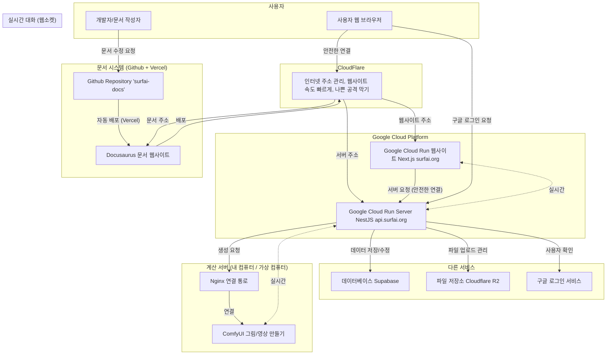

# 시스템 구조

🏛️ 프로젝트 시스템 구조: SurfAI
마지막 업데이트: 2025년 6월 29일

이 문서는 SurfAI 서비스의 전체적인 시스템 구조, 각 부분이 하는 일, 그리고 데이터가 어떻게 움직이는지 자세히 설명합니다.

---

## 1. 시스템 구조 목표와 규칙

-   **역할 나누기:** 웹사이트, 서버, 계산 서버, 문서 등 각 부분은 따로 관리되어 자기 역할만 하도록 합니다.
-   **서버 없이 먼저:** 가능하면 서버를 직접 관리하지 않아도 되는 `Google Cloud Run` 같은 서비스를 써서, 사람들이 많이 들어와도 자동으로 늘어나고 줄어들어서 돈을 아낄 수 있는 시스템을 만들어요.
-   **상자(컨테이너)로 통일:** 웹사이트와 서버 모두 `Docker`라는 상자에 넣어서 만들어요. 이렇게 하면 개발할 때와 실제 서비스할 때 환경이 똑같아서 문제가 생길 일이 줄고, 배포도 쉬워져요.
-   **보안:** 모든 통신은 `HTTPS`로 안전하게 암호화돼요. `Cloudflare`로 기본적인 보안(나쁜 공격 막기)을 하고, 서버에서는 `JWT`, `CSRF`, 역할에 따른 접근 제한 같은 여러 겹의 보안을 적용해요.

---

## 2. 전체 시스템 그림

---

## 3. 각 부분의 자세한 역할

### 가. 웹사이트 (프론트엔드) - `comfy-surfai-frontend-next`

-   **어디서 돌아가나:** `Google Cloud Run` (Docker 상자)
-   **주소:** `surfai.org`
-   **기술:** `Next.js` (앱 라우터), `TypeScript`, `Tailwind CSS`, `shadcn/ui`
-   **주요 역할:**
    -   사용자에게 보이는 모든 화면(`React` 프로그램)을 보여줘요.
    -   `AuthContext`를 통해 사용자의 로그인 상태를 전체적으로 관리하고, `HttpOnly` 쿠키에 있는 토큰으로 작동해요.
    -   `lib/apiClient.ts`를 통해 모든 서버 요청을 한곳에서 처리하고, 로그인 토큰이 만료되면 자동으로 다시 받는 기능도 있어요.
    -   `hooks/useComfyWebSocket.ts`를 통해 서버의 `WebSocket`과 연결해서 그림/영상 만드는 진행 상황이나 결과물을 실시간으로 받아서 화면에 보여줘요.

### 나. 서버 (백엔드) - `comfy-surfai-backend`

-   **어디서 돌아가나:** `Google Cloud Run` (Docker 상자)
-   **주소:** `api.surfai.org`
-   **기술:** `NestJS`, `TypeORM`, `PostgreSQL`, `Passport.js`
-   **주요 역할:**
    -   모든 중요한 작업들을 처리하는 **기억하지 않는** 서버예요.
    -   **로그인:** `Google 로그인`이나 일반 로그인 요청을 처리하고, 확인된 사용자에게 `JWT`(로그인 토큰/새로고침 토큰)를 만들어서 `HttpOnly` 쿠키로 사용자에게 보내줘요. `JwtAuthGuard`와 `RolesGuard`를 통해 각 기능에 접근할 수 있는 사람을 정해요.
    -   **그림/영상 만들기 과정:** 웹사이트에서 받은 만들기 요청을 `ComfyUI` 계산 서버로 보내고, `WebSocket`을 통해 진행 상황을 웹사이트에 실시간으로 알려줘요.
    -   **결과물 처리:** `ComfyUI`가 만들기를 끝내면, 결과 파일(그림/영상)을 다운로드해서 `Cloudflare R2`에 올리고, 관련된 정보(사용한 설정 등)를 `PostgreSQL` 데이터베이스에 계속 기록해요.

### 다. 계산 서버

-   **어디서 돌아가나:** 내 컴퓨터 또는 클라우드 그래픽 카드 가상 컴퓨터 (필요할 때만 쓰는 컴퓨터)
-   **기술:** `ComfyUI`
-   **주요 역할:**
    -   서버에서 받은 작업과 설정을 가지고 실제로 AI 계산을 하는 힘든 일을 맡아요.
    -   만드는 과정에서 생기는 `진행 상황`, `완료` 같은 실시간 메시지를 `WebSocket`을 통해 서버로 보내요.
    -   **Nginx 연결 통로**를 써서 외부 인터넷에 안전하게 연결되고, 기본적인 비밀번호 확인으로 처음 접근하는 사람을 제한해요.

### 라. 클라우드 시스템

-   **Google Cloud Run:** 웹사이트와 서버 `Docker` 상자를 돌리고, 사람들이 많이 들어오면 자동으로 늘어나고 줄어드는 서버 없는 환경을 제공해요.
-   **PostgreSQL (Supabase에서 제공):** 사용자, 작업 과정, 만든 기록 등 모든 데이터를 계속 저장하는 데이터베이스예요.
-   **Cloudflare R2:** 만들어진 그림/영상 파일을 저장하는 공간이에요. (비공개 공간과 공개 공간으로 나눠서 사용해요)
-   **Cloudflare (전체):** `surfai.org` 주소의 `DNS`를 관리하고, 나쁜 공격 막기, 웹사이트 속도 빠르게 하기 같은 보안 및 성능을 좋게 하는 기능을 제공해요.

### 마. 문서 시스템 - `surfai-docs`

-   **어디서 돌아가나:** `Vercel`
-   **주소:** `docs.surfai.org`
-   **기술:** `Docusaurus`, `React`, `Markdown(MDX)`
-   **주요 역할:**
    -   프로젝트의 모든 기술 문서, 시스템 구조, 결정 기록 등을 웹사이트 형태로 보여주는 **가장 정확한 정보원** 역할을 해요.
    -   모든 문서는 `Markdown` 파일로 작성되어 `GitHub`에서 프로그램 코드와 함께 관리돼요.
    -   `Vercel`과 `Git`을 연결해서, `main` 브랜치에 내용이 바뀌면 자동으로 웹사이트를 만들고 배포하는 시스템이 있어요.
    -   여러 나라 언어(한국어, 영어 등)로 문서를 제공하는 기능도 있어요.

---

## 4. 주요 데이터 흐름

### 가. 사용자 로그인 과정 (`HttpOnly` 쿠키 + `JWT`)

1.  **로그인 시도:** 웹사이트에서 `/api/auth/google` 또는 `/api/auth/login` 주소로 요청을 보내요.
2.  **확인 및 토큰 주기:** 서버는 사용자를 확인한 후, 로그인 토큰(15분)과 새로고침 토큰(2일)을 만들어요.
3.  **쿠키 설정:** 서버는 응답에 `Set-Cookie`라는 것을 통해, 만들어진 토큰들을 `HttpOnly`, `Secure`, `SameSite=None` (실제 서비스 환경) 속성을 가진 쿠키로 웹 브라우저에 저장시켜요.
4.  **서버 요청:** 그 다음 웹사이트의 `apiClient`는 `credentials: 'include'` 설정을 통해, 모든 서버 요청 시 웹 브라우저가 자동으로 쿠키를 포함해서 보내도록 해요.
5.  **토큰 확인:** 서버의 `JwtAuthGuard`는 요청 쿠키에 있는 `access_token`을 확인해서 사용자가 맞는지 확인해요.
6.  **토큰 다시 받기:** 로그인 토큰이 만료돼서 `401` 에러가 나면, `apiClient`가 자동으로 `/api/auth/refresh` 주소로 요청을 보내요. 서버의 `JwtRefreshGuard`가 `refresh_token` 쿠키를 확인하고, 성공하면 새로운 토큰들을 쿠키로 다시 설정해줘요.

### 나. 그림/영상 만들기 과정

1.  **요청:** 사용자가 웹사이트에서 설정을 입력하고 "만들기" 버튼을 누르면, `POST /api/generate` 주소로 요청이 가요.
2.  **작업 전달:** 서버는 요청을 받아서 문제가 없는지 확인하고, `ComfyUI` 계산 서버로 작업을 보내요.
3.  **실시간 알려주기:** 계산 서버는 만드는 과정에서 생기는 `진행 상황` 같은 실시간 메시지를 `WebSocket`을 통해 서버로 보내요. 서버의 `EventsGateway`는 이 메시지를 받아서 다시 웹사이트에 실시간으로 알려줘요.
4.  **결과물 처리:** 만들기가 끝나면(`완료` 메시지), 서버는 결과 파일을 `R2`에 올리고 데이터베이스에 기록해요.
5.  **최종 알림:** 서버는 최종 결과 정보(데이터베이스 ID, 미리 볼 수 있는 주소 등)를 `generation_result` `WebSocket` 메시지로 웹사이트에 보내서, 결과물이 화면에 보이도록 해요.
